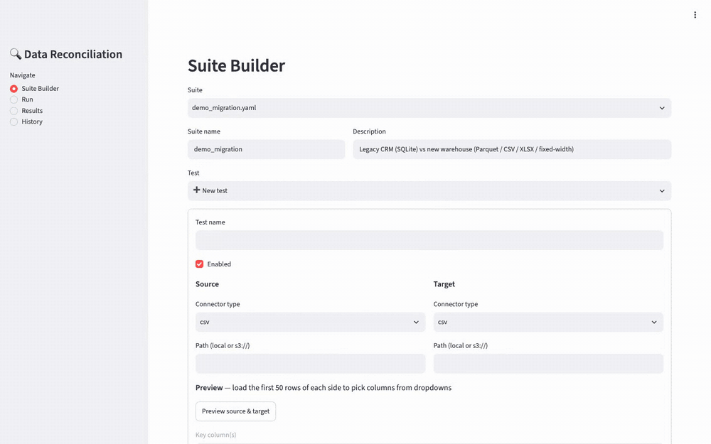
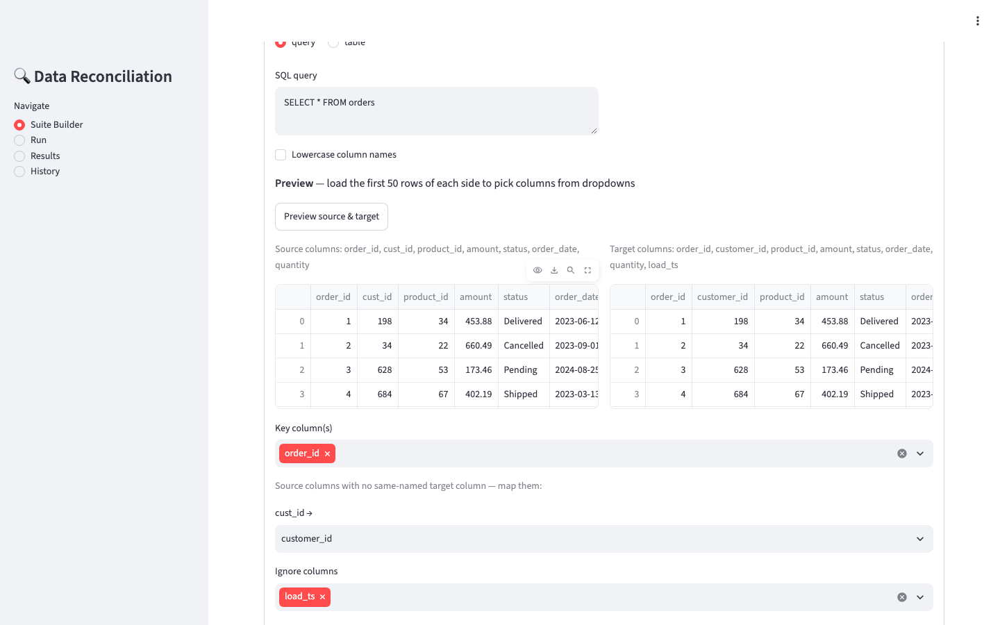
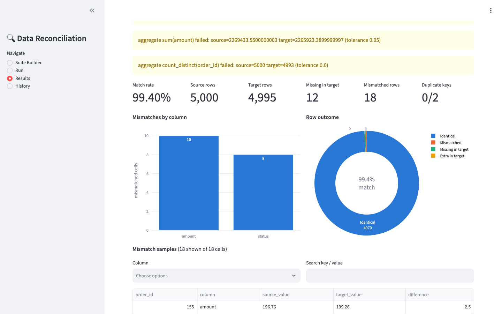
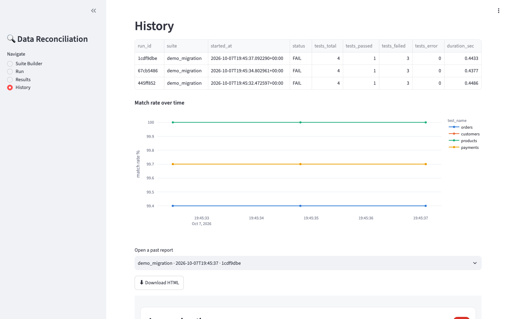
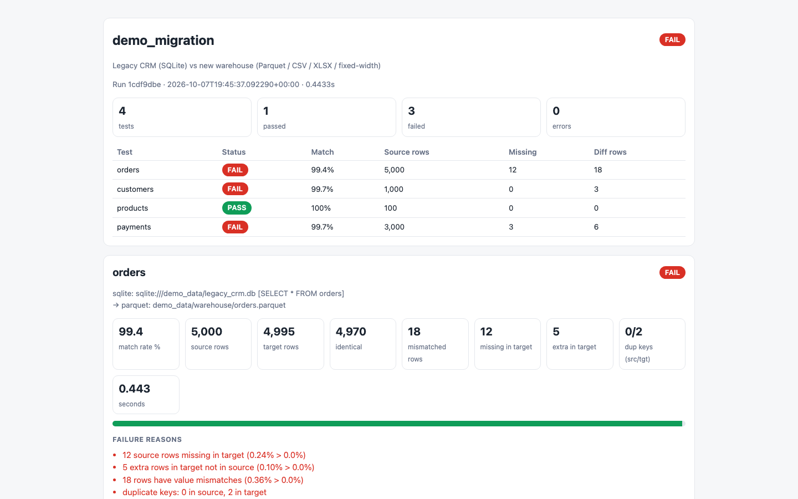
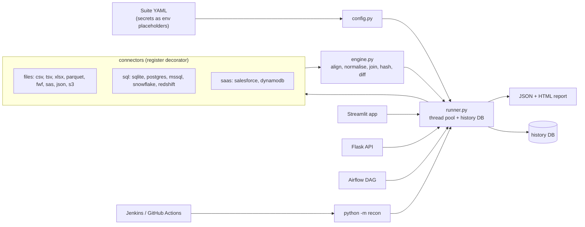

# Data Reconciliation Framework

[](https://github.com/Vinaycodes23/data-recon-framework/actions/workflows/ci.yml)

[](LICENSE)



**Live demo:** _coming soon_ <!-- replace with your https://<app-name>.streamlit.app URL after deploying -->

Compare a **source** dataset against a **target** dataset (a legacy DB vs. a new warehouse after a migration, say) and find missing rows, extra rows, duplicate keys, value mismatches, schema drift and aggregate drift. Define tests in YAML, run them from a CLI, Streamlit app, REST API or Airflow, and get a self-contained HTML report plus a run history. It runs fully on a laptop with seeded demo data; the connector design supports SQLite, Postgres, SQL Server, Snowflake, Redshift, S3 files, Salesforce and DynamoDB in production.

Python 3.11+ · pandas · SQLAlchemy 2 · Streamlit · Flask · Airflow

## Quickstart

```bash
make install seed app      # venv + deps, demo data with planted defects, Streamlit UI
make run                   # or: reconcile the demo suite from the CLI
make test                  # pytest + coverage
```

`make seed` prints exactly which defects it planted; the integration test asserts the engine finds precisely those.

## Screenshots

| Suite Builder | Results |
|---|---|
|  |  |
| **History** | **HTML report** |
|  |  |

Regenerate them with `python scripts/capture_docs.py` (needs Playwright and ffmpeg).

## Architecture



## Suite YAML reference

```yaml
suite: demo_migration
description: Legacy CRM vs new warehouse
tests:
  - name: orders
    enabled: true                                # default true
    source: {type: sqlite, url: "sqlite:///${DEMO_DATA_DIR:-demo_data}/legacy_crm.db", query: "SELECT * FROM orders"}
    target: {type: parquet, path: demo_data/warehouse/orders.parquet}
    keys: [order_id]                             # composite keys supported
    column_map: {cust_id: customer_id}           # source name -> target name
    ignore_columns: [load_ts]
    tolerance: {amount: 0.01}                    # absolute, per numeric column
    options:                                     # defaults shown
      trim_strings: true
      case_insensitive: false
      null_equals_null: true
      empty_string_as_null: true
      max_mismatch_samples: 500
    aggregates:                                  # sum count count_distinct min max mean null_count
      - {column: amount, func: sum, tolerance: 0.05}
    thresholds:                                  # percentages are of source rows
      max_missing_pct: 0
      max_mismatch_pct: 0
      allow_duplicate_keys: false
      allow_schema_drift: true                   # drift is always reported; set false to fail on it
```

* **Secrets** never live in YAML: use `${VAR}` or `${VAR:-default}`; they are resolved at run time. The Streamlit editor loads suites *unresolved*, so saving never writes a secret to disk.
* **Connector fields**: SQL (`url` + `query`, or `table` [+ `schema`, `where`], `lowercase_columns`); files (`path`, optional `read_options` passed to pandas; `fwf` needs `widths`/`colspecs` + `names`); Salesforce (`username`, `password`, `security_token`, `soql`); DynamoDB (`table`, `region`).
* **Exit codes** (`python -m recon run suite.yaml [--test NAME] [--workers 4] [--no-save] [--fail-on-mismatch]`): `1` on ERROR, or on FAIL with `--fail-on-mismatch`. Also `validate` and `history` subcommands.

Environment: `RECON_HISTORY_URL` (default `sqlite:///reports/recon_history.db`), `RECON_REPORTS_DIR` (default `reports`), `RECON_SUITES_DIR` (API).

## How a test is evaluated

1. **Align columns**: `column_map`, then case-insensitive matching, minus `ignore_columns`.
2. **Schema check**: columns only on one side; dtype and kind (numeric / string / datetime / boolean) per column.
3. **Normalise** each column pair to one type: datetime if either side is a datetime and the other parses; numeric if *every* non-null value on both sides parses (so `"1,234.50"` and `"00123.40"` from fixed-width files compare equal to `1234.5` and `123.4`); otherwise string with trim / case / empty-as-null options.
4. **Normalise keys** so `1`, `1.0` and `" 1 "` join. Numeric-looking string keys are treated as numbers (so `"007"` joins `7`); non-numeric keys are trimmed strings.
5. **Duplicate keys** are counted and sampled on each side; the first row is kept.
6. **Outer join** on keys: missing in target, missing in source, matched.
7. **Hash pre-filter** (below).
8. **Column diff** only for rows whose hash differs, with per-column tolerance and null rules, as long-format samples (key, column, source_value, target_value, difference).
9. **Aggregates** over the full tables with tolerance.
10. **Verdict** PASS / FAIL against thresholds with readable reasons. Any exception becomes `ERROR`; `run_test` never raises.

### The hash pre-filter

After normalisation, every matched row is reduced to a 64-bit hash on each side with `pd.util.hash_pandas_object`, and the two hash vectors are compared in one vectorised operation. Equal hashes mean identical rows and are skipped entirely; only the (usually tiny) set of rows with different hashes goes through the column-by-column diff, which is where tolerance, null rules and sample extraction happen. The cost for the common case (almost everything matches) is therefore one pass of hashing instead of N-columns of Python-level comparisons. Because the hash is exact, tolerance can only turn a hash difference into "equal" (e.g. 10.001 vs 10.0 with tolerance 0.01), never the reverse, so correctness is preserved. When `null_equals_null: false`, rows containing nulls bypass the filter.

## Add a connector

One decorated function in `recon/connectors/` returning a DataFrame:

```python
from recon.connectors.base import register

@register("mongo")
def load_mongo(spec: dict) -> pd.DataFrame:
    import pymongo                       # lazy import keeps the dependency optional
    ...
    return pd.DataFrame(docs)
```

Then use `source: {type: mongo, ...}`. Import the module in `recon/connectors/__init__.py`.

## Benchmark

Produced by `python scripts/benchmark.py` (synthetic 8-column table; 0.5% of rows with amount drift, 0.5% with status case changes, 0.1% rows dropped; the script asserts the engine found exactly those). Times are `run_test` on in-memory frames, so connector I/O is excluded.

```
Machine: macOS-26.6.2-arm64-arm-64bit-Mach-O / arm / Python 3.13.5 / pandas 3.0.6
```

| Rows | Columns | Median time (s) | Best (s) | Rows/sec | Mismatched rows found | Missing found | Peak RSS (MB, cumulative) |
|---:|---:|---:|---:|---:|---:|---:|---:|
| 100,000 | 8 | 0.72 | 0.70 | 139,593 | 1,000 | 100 | 212 |
| 1,000,000 | 8 | 10.16 | 8.38 | 98,420 | 10,000 | 1,000 | 804 |

(Peak RSS is process-wide and cumulative across the sizes in one invocation. Re-run the script on your own machine; results vary.)

## Scaling beyond memory

**The row-level engine is in-memory pandas.** Measured with `scripts/benchmark.py`: 1,000,000 rows x 8 columns reconcile in 10.16 s (median) with a peak process RSS of 804 MB; 100,000 rows take 0.72 s. I have not benchmarked the row-level engine beyond 1M rows, and both tables must fit in RAM at once, so it is the wrong tool for tens of millions of rows on a laptop. What I would do, in order of effort:

1. **Push aggregate checks down to the database (implemented).** `recon/pushdown.py` answers `sum / count / count_distinct / min / max / mean / null_count` with one `SELECT` per side, in the source database over SQLAlchemy or in DuckDB for parquet/csv, and compares the results with the same tolerance rule as the engine. Nothing is loaded into pandas. Measured with `scripts/benchmark_pushdown.py` (4 aggregates, results asserted equal to the pandas path):

   | Source | Rows | Load into pandas + aggregate (s) | Pushdown (s) | Speedup |
   |---|---:|---:|---:|---:|
   | DuckDB on parquet | 1,000,000 | 1.02 | 0.199 | 5x |
   | SQL on SQLite | 1,000,000 | 4.48 | 0.648 | 7x |
   | DuckDB on parquet | 10,000,000 | 11.91 | 0.569 | 21x |

   Caveats: it is a library function (`from recon.pushdown import pushdown_aggregates`), not yet wired into the YAML runner; it uses native SQL semantics (NULL is the only null, strings are not parsed as numbers); and it cannot find missing or mismatched rows.
2. **Chunked / partitioned comparison by key range (not implemented).** The join is on keys, so both sides can be split into disjoint partitions (key ranges, or `hash(key) % N`), each pulled with a `WHERE` clause and run through the existing engine, then counts summed and samples capped. Memory is bounded by the partition size instead of the table size, and partitions can run in parallel. Duplicate-key and missing-row counts stay exact because a key always lands in the same partition on both sides.
3. **DuckDB or Spark for 100M+ rows (not implemented).** Express the same pipeline as SQL: a full outer join on the keys, a row hash over the normalised columns to skip identical rows, then a column diff over the rows whose hashes differ. DuckDB does this out-of-core on one machine; Spark scales it across a cluster. The hash pre-filter and the normalisation rules carry over unchanged, only the execution engine changes.

## Deploying the Streamlit demo

The app is deployable on Streamlit Community Cloud as is: `requirements.txt` holds runtime dependencies only (dev tools live in `requirements-dev.txt`), `.streamlit/config.toml` carries the settings, and on first start the app seeds the demo data itself. In the cloud, demo data, reports and the history DB are written under the system temp directory (set `RECON_CLOUD=1` to get the same behaviour elsewhere), so history resets when the app restarts. Pick Python 3.12 in the deploy dialog's Advanced settings.

## Other pieces

* **Streamlit** (`make app`): Suite Builder (forms per connector, 50-row preview, dropdowns for keys / mapping / ignore / tolerance / aggregates, live YAML), Run (progress + summary), Results (KPIs, Plotly charts, filterable mismatches, downloads), History (trend line, open past reports).
* **Flask API** (`make api`): `GET /health`, `GET /api/suites`, `POST /api/runs {"suite": "demo_migration.yaml", "tests": [...]}`, `GET /api/runs`, `GET /api/runs/<id>`, `GET /api/runs/<id>/report`. Suite names are whitelist-validated against `suites/`, so path traversal is rejected.
* **Airflow** (`airflow/dags/recon_dag.py`): daily `data_reconciliation` DAG, one task per suite file, `AirflowFailException` on FAIL/ERROR. Repo path from the Variable `recon_repo_path`.
* **Jenkins**: install, ruff, pytest with coverage, seed + demo run (that stage alone may fail), archive `reports/`.
* **Optional connectors**: `pip install -r requirements-optional.txt`.

## Interview talking points

* **pandas in-memory vs. chunked / pushdown.** The engine is in-memory pandas for clarity and speed up to a few million rows (see benchmark: ~1M rows in ~10 s, <1 GB). For hundreds of millions of rows I would push work to the databases: compute per-bucket checksums (`HASH(row)` grouped by key range) on both sides, compare only the bucket digests, and pull only the mismatching buckets into the engine. The pipeline already has that shape (hash first, diff the remainder), so the pushdown is a connector concern, not a rewrite.
* **Why hashing.** Row equality is the overwhelmingly common outcome after a migration; hashing makes that case one vectorised pass and confines the expensive, tolerance-aware diff to the few rows that differ. Hashing happens *after* normalisation, so `"1,234.50"` and `1234.5` hash identically.
* **Why YAML config.** Reconciliation suites are reviewed, versioned and owned by data engineers and analysts, not only developers; declarative files diff cleanly in PRs, can be generated by the Streamlit builder, and drive CLI, API, Airflow and CI identically.
* **Secrets.** Never stored in YAML: `${VAR}` placeholders resolved at run time; the editor loads unresolved so it cannot leak them on save; descriptions and logs mask passwords in URLs.
* **Never-raise contract.** `run_test` converts every failure (bad connector, missing key, type error) into an `ERROR` result so one broken test cannot take down a suite; CI/Airflow distinguish ERROR from FAIL via exit codes.
* **Pandas gotchas handled.** pandas 3 string dtype, NaN vs None vs NaT, `-0.0` vs `0.0` in hashes, float noise at tolerance boundaries, fixed-width numbers stored as zero-padded strings.
* **Known limits.** Integers beyond 2^53 lose precision in numeric comparison; string keys that look numeric are matched numerically; duplicate keys keep the first row (flagged, not merged); the API runs synchronously.

## License

[MIT](LICENSE)
